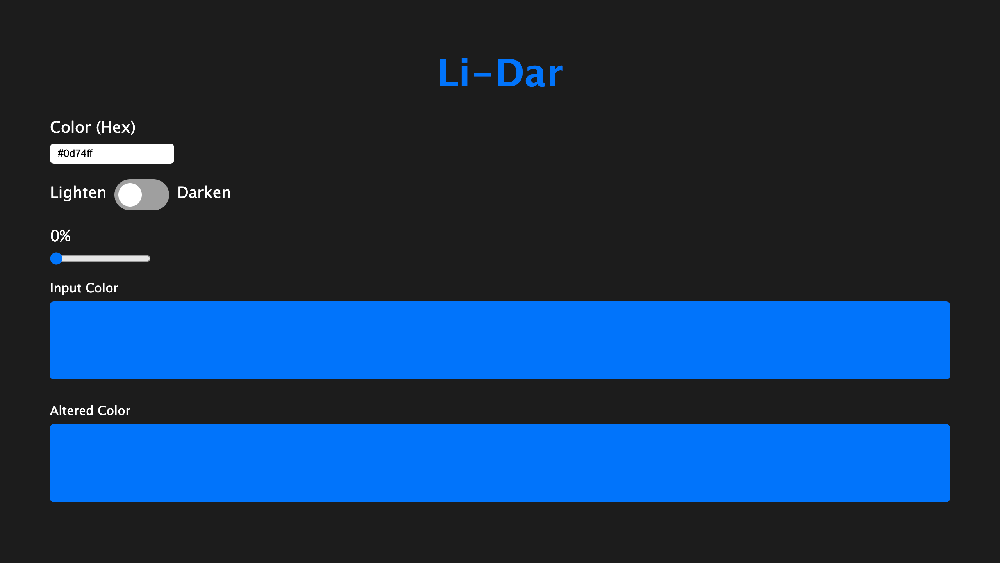

# Javascript Color Changing Tool

A simple tool that takes your color input as a hexcode (#000000) and you can lighten and darken it by a slider giving you the respective hexcode of the resultant color.

